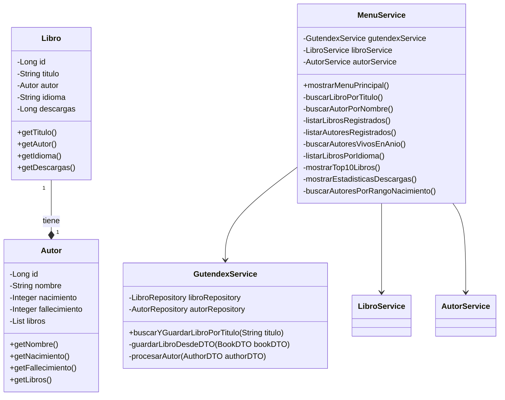

# 🧠 Sistema de Consulta de Libros y Autores 📚


Aplicación Java con Spring Boot para consultar información de libros y autores utilizando la API de Gutendex. Permite buscar libros por título, listar libros registrados, buscar autores, obtener estadísticas y más.

---

## ✨ Características principales

- 🔍 Búsqueda de libros por título (con normalización de entrada)
- 📚 Listado de libros registrados con detalles
- 👤 Búsqueda de autores por nombre
- 🧾 Listado de autores registrados con sus obras
- 🌍 Filtrado de libros por idioma con estadísticas
- 🏆 Top 10 libros más descargados
- 📅 Búsqueda de autores vivos en año específico
- 📊 Estadísticas detalladas de descargas
- 🕰️ Búsqueda de autores por rango de nacimiento

---

## 🛠️ Tecnologías utilizadas

- **Java 17**
- **Spring Boot 3.5.3**
- **Spring Data JPA**
- **PostgreSQL**
- **Maven**
- **Gutendex API**

---

## 📊 Diagrama de clases



---

## 🚀 Instalación y ejecución

### Requisitos previos

- Java 17  
- Maven  
- PostgreSQL

### Pasos para ejecutar

1. **Configurar base de datos PostgreSQL**  
   - Crear una base de datos llamada `literatura`  
   - Configurar usuario y contraseña en `application.properties`

2. **Clonar el repositorio**
```bash
git clone https://github.com/Alejolora25/LiteraturaConsultaDeLibros.git
```

3. **Navegar al directorio del proyecto**
```bash
cd LiteraturaConsultaDeLibros
```

4. **Compilar y ejecutar con Maven**
```bash
./mvnw spring-boot:run
```

5. **Interactuar con la aplicación**
   - La aplicación mostrará un menú en la consola
   - Selecciona opciones usando números del 1 al 10

---

## 💻 Uso de la aplicación

### Menú principal

```
===== MENÚ PRINCIPAL =====
1. Buscar libro por título
2. Listar libros registrados
3. Buscar autores por nombre
4. Listar autores registrados
5. Listar libros por idioma
6. Top 10 libros más descargados
7. Buscar autores vivos en año específico
8. Estadísticas de descargas
9. Buscar autores por rango de nacimiento
10. Salir
```

### Funcionalidades destacadas

#### 🔍 Buscar libro por título
- Busca libros en Gutendex API por título
- Guarda los resultados en la base de datos
- Maneja normalización de títulos (espacios, mayúsculas/minúsculas)

#### 🌍 Listar libros por idioma

```
=== OPCIONES DE IDIOMA ===
1. Buscar libros por idioma específico
2. Ver estadísticas de todos los idiomas
```

- Muestra distribución de libros por idioma
- Calcula porcentajes de cada idioma
- Permite filtrar por código de idioma (ej: es, en, fr)

---

## 📊 Estadísticas de descargas

```
=== ESTADÍSTICAS DE DESCARGAS ===
Total de libros: 25
Mínimo de descargas: 50
Máximo de descargas: 1500
Promedio de descargas: 345.67
Suma total de descargas: 8642

Distribución por rangos de descargas:
- 0-99: 5 libros (20.0%)
- 100-499: 12 libros (48.0%)
- 500-999: 6 libros (24.0%)
- 1000+: 2 libros (8.0%)
```

---

## 📚 Ejemplos de libros para buscar

- *Pride and Prejudice* - ID: 1342 (Inglés)
- *Frankenstein* - ID: 84 (Inglés)
- *Don Quijote* - ID: 2000 (Español)
- *The Metamorphosis* - ID: 5200 (Alemán/Inglés)
- *Alice's Adventures in Wonderland* - ID: 11 (Inglés)

---

## 🤝 Contribuciones

¡Las contribuciones son bienvenidas!

1. Haz un fork del repositorio  
2. Crea una rama para tu feature  
   ```bash
   git checkout -b feature/nueva-funcionalidad
   ```
3. Haz commit de tus cambios  
   ```bash
   git commit -am 'Agrega nueva funcionalidad'
   ```
4. Haz push a la rama  
   ```bash
   git push origin feature/nueva-funcionalidad
   ```
5. Abre un Pull Request

---

## 👤 Autor

**Alejandro Lora**  
Proyecto desarrollado como parte del reto de Alura Latam.
